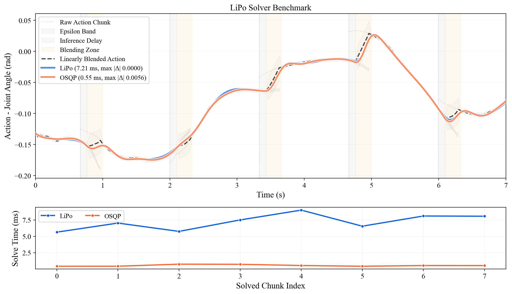

# lipo
LiPo: A Lightweight Post-optimization Framework for Smoothing Action Chunks Generated by Learned Policies

## Installation
### Option 1: pip
```
pip install action-lipo
```

### Option 2: from source
   1. Clone the repository:
      ```bash
      git clone https://github.com/lab-dream/lipo.git
       ```
   
   2. Navigate to the cloned directory:
       ```bash
       cd lipo
       ```
   
   3. Install the package:
       ```bash
       pip install -e .
       ```

## Run & Visualization
   - Visualize lipo:
       [lipo_visualization.ipynb](lipo_visualization.ipynb)

   - Benchmark:
       ```
       python lipo_benchmark.py --save media/lipo_benchmark.png
       ```

   
   | Implementation | Avg [ms] | Std [ms] | Mean \|Δ\| vs LiPo | Max \|Δ\| vs LiPo |
   | --- | ---: | ---: | ---: | ---: |
   | LiPo | 7.207 | 1.112 | 0.000000 | 0.000000 |
   | OSQP QP ⚡ | 0.553 | 0.119 | 0.000740 | 0.005626 |

## ROS 2 Integration
LiPo can also be used within ROS 2 pipelines.
See: https://github.com/lab-dream/lipo_ros2
